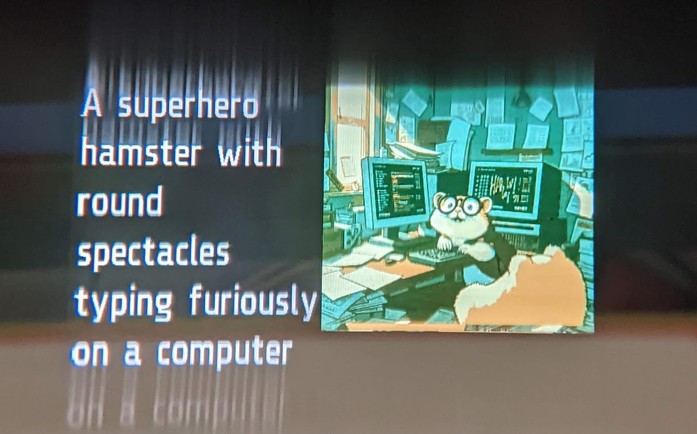
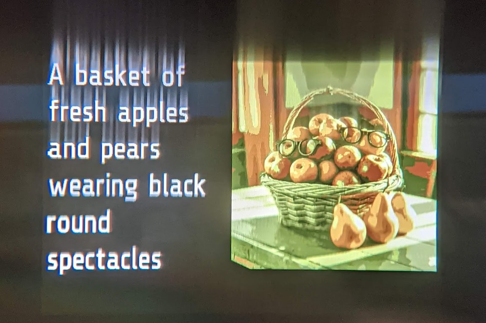
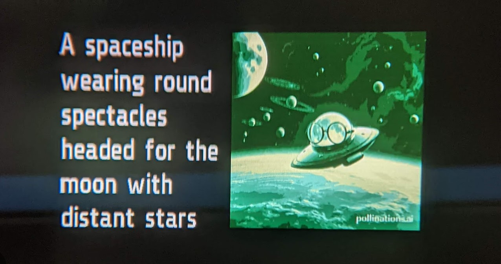
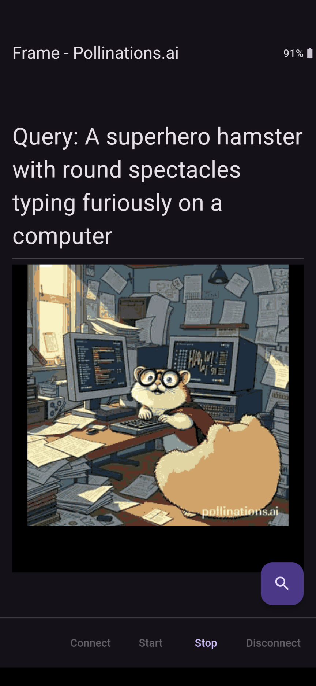

# Pollinations.ai Image Generation

Listens for an image generation prompt from the user, requests image generation from [Pollinations.ai](https://pollinations.ai/) using its [API](https://github.com/pollinations/pollinations/#readme) and displays the query and the generated image for display in Frame. (Note, image generation can take several seconds depending on load and other factors.)

Click on the generated image in the phone app to save/share using the device Share mechanism.

Flutter package `speech_to_text` uses platform-provided speech to text capability which uses the phone microphone, not the Frame microphone.

Thumbnails generated by Pollinations.ai are quantized to 4-bit (16 colors) and dithered using the [Dart image package](https://pub.dev/packages/image) and displayed progressively.

Tested on Android, but should be able to work on iOS also.

### Frameshots

### Framecast

### Screenshots

